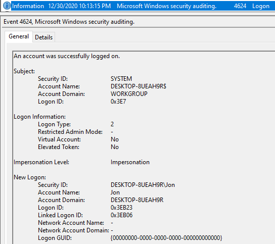
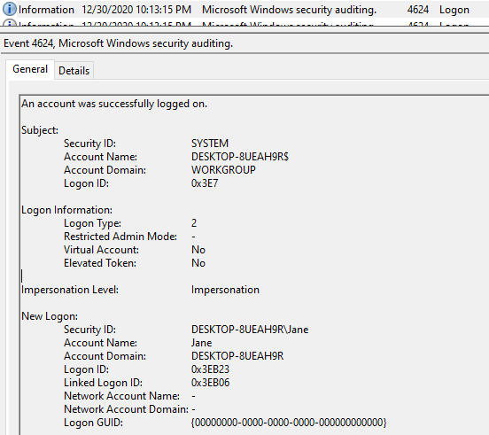
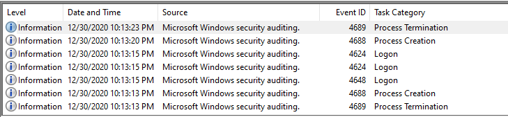
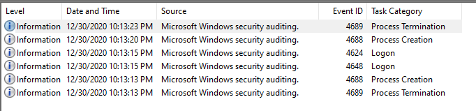
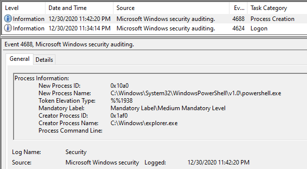
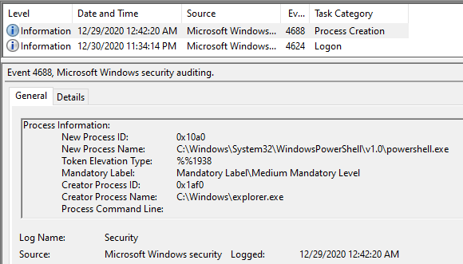

# Use Cases

Please make sure, that all installation requirements (e.g. installed packages in virtual environment) are fulfilled

## 001 Replace username

This use case replaces a given account name with a new value in all records. All event data field named *TargetUserName* and *SubjectUserName* will be modified.
Additionally the *TargetUserSid* and *SubjectUserSid* will be changed.

See [001_replace_username.py](001_replace_username.py)

```shell
$ python3 -m usecases.001_replace_username -h
usage: 001_replace_username.py [-h] src dest old_username new_username new_sid

Replace a given username with new value.

positional arguments:
  src           Path to the source Windows EVTX event log file
  dest          Path to the source Windows EVTX event log file
  old_username  Old username
  new_username  New username
  new_sid       SID of new user

optional arguments:
  -h, --help    show this help message and exit
```

| Original      | Result  |
| ------------- |:-------------:| 
|      |  | 

## 002 Delete logon

This use case deletes all logon records (EventID 4624) for a given account name.

**Note**: Currently all logon records with resident templates will be ignored and not be deleted.

See [002_delete_logon.py](002_delete_logon.py)

```shell
$ python3 -m usecases.002_delete_logon -h
usage: 002_delete_logon.py [-h] src dest username

Replace a given username with new value.

positional arguments:
  src         Path to the source Windows EVTX event log file
  dest        Path to the source Windows EVTX event log file
  username    Account name of user

optional arguments:
  -h, --help  show this help message and exit
```

| Original      | Result  |
| ------------- |:-------------:| 
|      |  |


## 003 Change timestamp

This use case changes the TimeGenerated timestamp for a given event record ID. The timestamp can be incremented or decremented.

**Note**: Currently the order of the events is not changed.

See [003_change_timestamp.py](003_change_timestamp.py)

```shell
$ python3 -m usecases.003_change_timestamp -h
usage: 003_change_timestamp.py [-h] [--days DAYS] [--hours HOURS]
                               [--minutes MINUTES] [--seconds SECONDS]
                               [--microseconds MICROSECONDS]
                               src dest eventrecordid

Changes the time generated of a given record

positional arguments:
  src                   Path to the source Windows EVTX event log file
  dest                  Path to the source Windows EVTX event log file
  eventrecordid         Event record id

optional arguments:
  -h, --help            show this help message and exit
  --days DAYS           Increment/Decrement days
  --hours HOURS         Increment/Decrement days
  --minutes MINUTES     Increment/Decrement days
  --seconds SECONDS     Increment/Decrement days
  --microseconds MICROSECONDS
                        Increment/Decrement days


```

| Original      | Result  |
| ------------- |:-------------:| 
|      |  |

